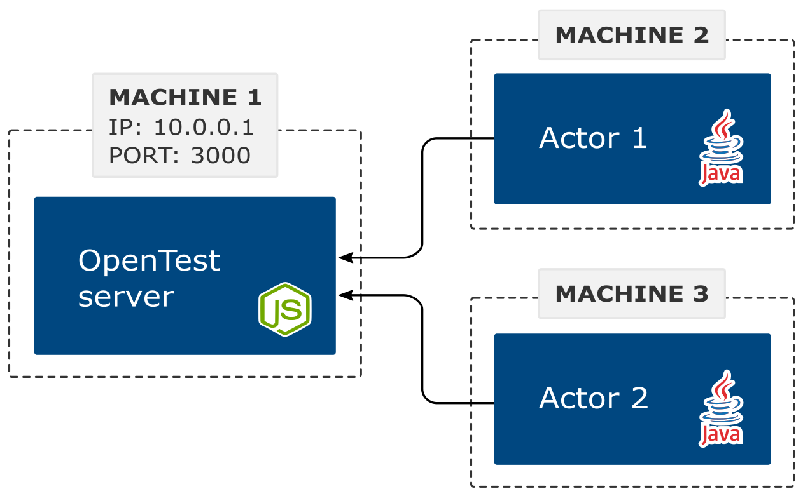

# [Ideias distribuidas](https://getopentest.org/docs/distributed-testing.html)

## Visão geral

A maioria dos testes automatizados são executados em apenas uma máquina e interagem apenas com uma janela de um navegador, aplicativo mobile ou serviço web (API). Porém, há alguns casos específicos onde será necessário executar alguns cenários de testes em duas ou mais maquinas, de forma sequencial ou  paralela. Para esse caso é necessário a execução de um teste distribuido.
O OpenTest tem um suporte muito bom para a construção de testes distribuídos, sendo este um dos primeiros objetivos de design da ferramenta.

Os desafios mais comuns ao desenvolver os testes distribuidos são:

- Controlar quais etapas de teste são executadas em cada máquina específica.
- Sincronizando a execução das etapas de teste para garantir que sejam executadas na sequência correta entre as várias máquinas.
- compartilhamento de dados gerados dinamicamente entre as maquinas que executam os testes.

O OpenTest responde a esses desafios de uma maneira que permite que os engenheiros de teste se concentem na lógica e no fluxo de teste, ao invés das complexidades que os testes distribuiudos possuem.

## Configuração de atores de teste

Um teste distrivuido envolve pelo menos dois atores de teste. os atores normalmente são executados em máquinas diferentes, mas também é possivel executar vários atores em uma única máquina. Isso é conveniente, porque significa que o mesmo teste pode ser executado inalterado em um ambiente de desenvolvimento em que tudo é executado na mesma máquina, bem como em um ambiente de teste de desempenho, ou em produção em que os componente de softeare são implantados em máquinas separadas.

O diagrama abaixo mostra um cenário bastante complexo, nele temos o servidor OpenTest e dois atores de teste são executados em três maquinas separadas:



É assim que os arquivos de configuração para os dois atores devem estar parecidos:

_MACHINE 2, C:\opentest\actor1\actor.yaml_
```yaml
actorType: ACTOR1
syncServerUrl: http://10.0.0.1:3000

# continuar com outros parâmetros aqui
```

_MACHINE 3, C:\opentest\actor2\actor.yaml_
```yaml
actorType: ACTOR2
syncServerUrl: http://10.0.0.1:3000

# continuar com outros parâmetros aqui
```

Os dois arquivos de configuração mais importantes que precisamos definir são os arquivos arquivo de configuração `actor.yaml`para cada ator de teste são:

- `actorType`: irá indicar qual ator de teste irá executar o teste
- `syncServerUrl`: irá indicar o _endpoint_ em que o servidor OpenTest está sendo escutando, para que o agente de teste saiba como se comunicar com o servidor.

## Sintaxe de teste distribuído

Vamos considerar um teste distribuído muito simples envolvendo os dois atores de teste descritos na seção anterior:

```yaml
description: Um simples teste distribuido
actors:
  - actor: ACTOR1
    segments:
      - segment: 1
        actions:
          - script: $log("Esse será executado primeiramente, desde que seja incluido o segment 1")

  - actor: ACTOR2
    segments:
      - segment: 2
        actions:
          - script: $log("Esse será executado em segundo lugar, desde que seja incluido o segment 2")
```

É importante ressaltar que esse teste distribuido possui algumas particularidades:

- Para que o teste comece a ser executado ele rquer uma ator de teste do tipo ACTOR1 e um outro ator de teste do tipo ACTOR2.
- O teste contém dois segmentos: segmento 1 (segment 1) e segmento 2 (segment 2). Os segmentos de teste são executados sequencialmente, portanto, as ações de teste no segmento 2 só serão executadas após a conclusão do segmento 1.
- O ACTOR1 está envolvido apenas no segmento 1 e o ACTOR2 está envolvido apenas no segmento 2. Qualquer ator de teste pode executar etapas de teste em qualquer segumento de teste e vários atores podem executar etapas de teste de um mesmo significado, caso seja necessário.

## Compartilhamento de dados entre atores de teste

Na maioria das vezes, os atores de teste envolvidos em um teste distribuido precisam "conversar" entre si para compartilhar vários dados (um identificador gerado dinamicamente, um código de avaliação de conta, etc). A maneira correta de compartilhar esses dados é utilizando o armazenamento compartilhado de dados. Para mais informações consulte a página [7 - Passando dados entre os passoas de teste](7%20-%20Passando%20dados%20entre%20os%20passoas%20de%20teste.md).

Abaixo, temos um exemplo de um teste distribuido simples que utiliza dados compartilhados:

```yaml
description: Um simples teste distribuido
actors:
  - actor: ACTOR1
    segments:
      - segment: 1
        actions:
          - script: |
              var randomNumber = 1 + Math.floor(Math.random() * 100);
              $sharedData.someRandomNumber =  randomNumber;

  - actor: ACTOR2
    segments:
      - segment: 2
        actions:
          - script: |
              $log("O número aleatório é " + $sharedData.someRandomNumber)
```

O primeiro ator de teste irá criar um número aleatorio em um bloco de script e irá gravar o valor nos dados compartilhados na variável `someRandomNumber``. O segundo ator de teste irá ler esse valor e enviar o valor da variável para o log da sessão de teste.